 # Basic docker training
 ## Exercise 1: Running 
### Pulling an image
### 1. 
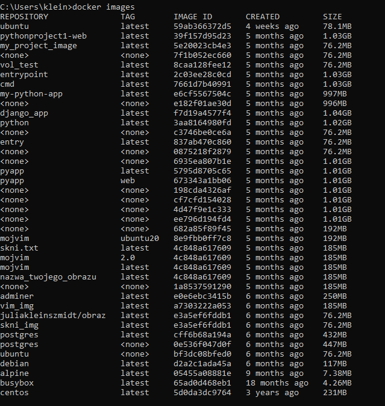

### 2. 
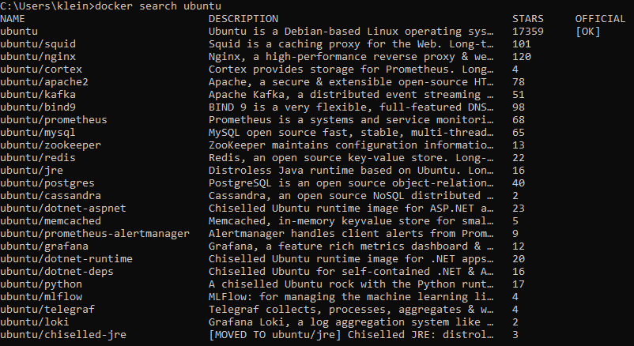
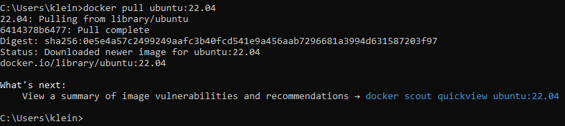

### 3. 
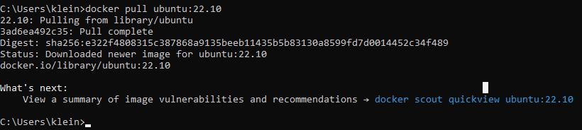
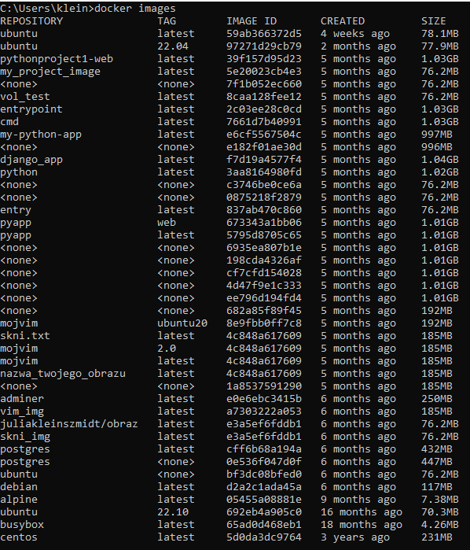

### 4. 
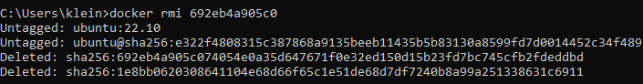

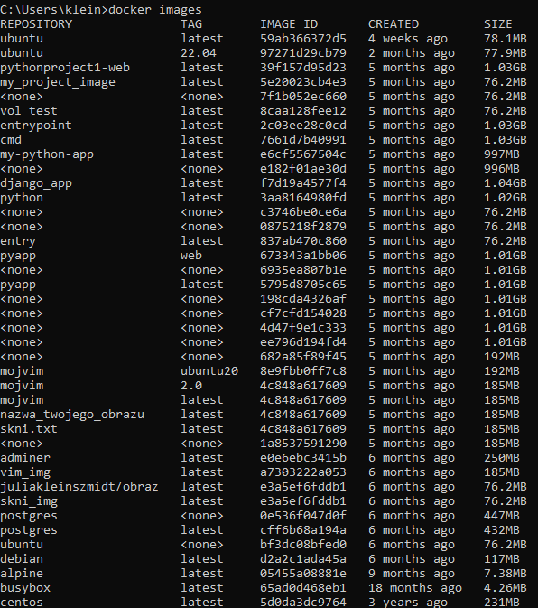

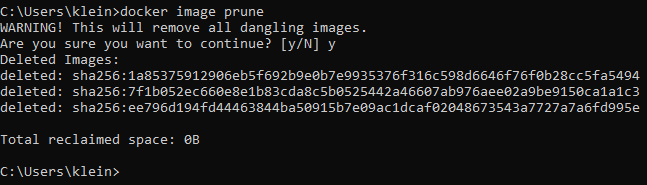

### Running our container
### 1.
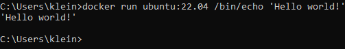
### 2.
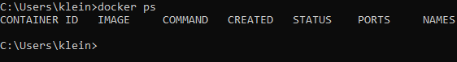
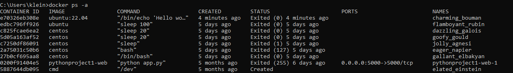
### 3.
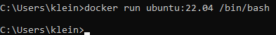

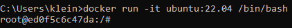
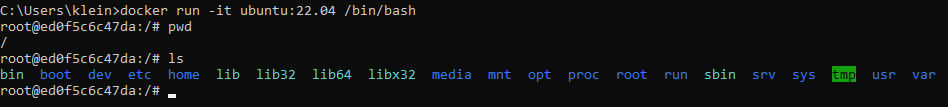
### 4.
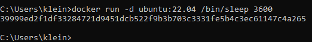
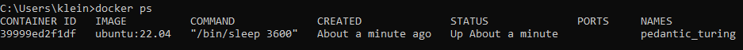
### 5.
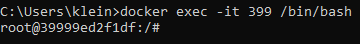
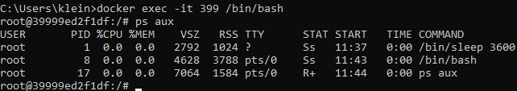
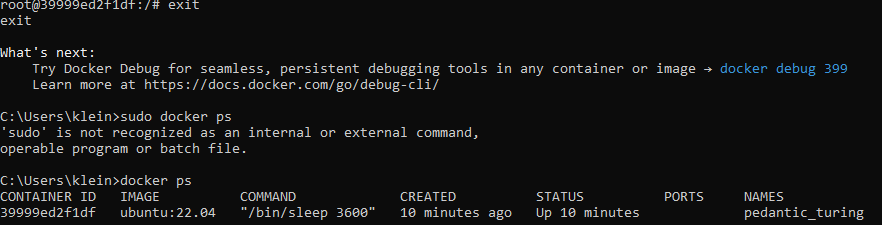
### 6.

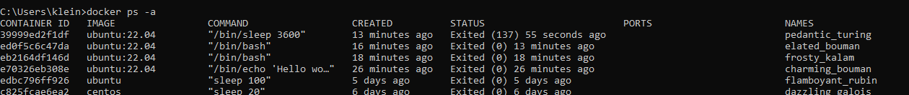
### 7.
 (ten sam co powyzej screen- 23)

## Exercise 2: Changing images
### Getting setup

## Exercise 3: Building images
### Getting setup
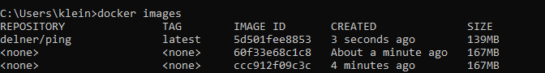

## Exercise 4: Sharing images
### Getting Started
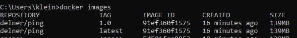

## Exercise 5: Volumes
### Setting up the server
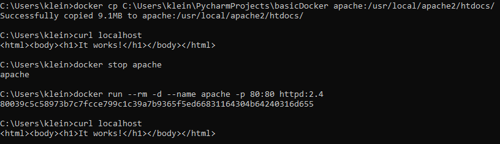

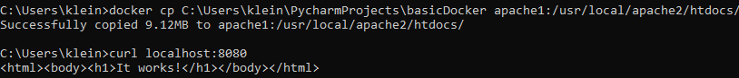

#### file:///C:/Users/klein/PycharmProjects/basicDocker/index.html

