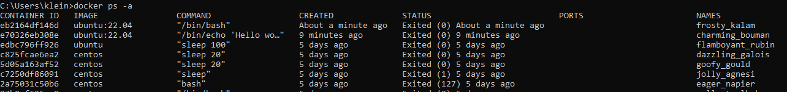
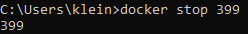

 # Basic docker training
 ## Exercise 1: Running 
### Pulling an image
### 1. 

### 2. 

### 3. 

### 4. 

### Running our container
### 1.

### 2.

### 3.

### 4.

### 5.

### 6.

### 7.
 (ten sam co powyzej screen- 23)

## Exercise 2: Changing images
### Getting setup

## Exercise 3: Building images
### Getting setup

## Exercise 4: Sharing images
### Getting Started

## Exercise 5: Volumes
### Setting up the server

#### file:///C:/Users/klein/PycharmProjects/basicDocker/index.html

