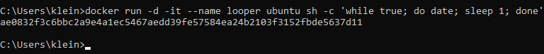

# DevOps with Docker part1
## Section 1
### tworzenie kontenera

### lista kontenerów

### zarządzanie

### nginx


## Section 2




### curl


## Section 3


### Hello.sh
![z](zrzuty/hellosh.png
### dockerfile


### script.sh
``
#!/bin/bash
while true
do
  echo "Input website:"
  read website; echo "Searching.."
  sleep 1; curl http://$website
done 
``
### dockerfile
````
# Use Ubuntu 22.04 as base image
FROM ubuntu:22.04

# Update and install curl
RUN apt-get update && apt-get install -y curl

# Copy the script into the container
COPY script.sh /script.sh

# Grant execute permissions to the script
RUN chmod +x /script.sh

# Set the script as the command to run when the container starts
CMD ["/script.sh"]
````
## Section 4


## Section 5


## Sekcja 6
### dockerfile
```
# We need ruby 3.1.0. I found this from Docker Hub
FROM ruby:3.1.0

EXPOSE 3000

WORKDIR /usr/src/app

# Install the correct bundler version
RUN gem install bundler:2.3.3

# Copy the files required for dependencies to be installed
COPY Gemfile* ./

# Install all dependencies
RUN bundle install

# Copy all of the source code
COPY . .

# Run database migrations
RUN rails db:migrate RAILS_ENV=production

# Precompile assets
RUN rake assets:precompile

# Run the application
CMD ["rails", "s", "-e", "production"]

```

