# Zadania na zaliczenie

### 1. Utwórz plik z obrazem Dockerfile, w którym z hosta do kontenera kopiowany będzie folder code (zawiera np. jeden skrypt w języku Python 🐍) i zbuduj go: uruchom ww. skrypt wewnątrz kontenera.
Tworze plpik code, a w nim skrypt Pythona o nazwie hello.py, następnie tworzę Dockerfile o zawartości:
````
# Użyj obrazu bazowego z Pythonem
FROM python:3.9-slim

# Utwórz folder roboczy w kontenerze
WORKDIR /app

# Skopiuj folder 'code' z hosta do kontenera
COPY code /app/code

# Ustaw domyślny katalog roboczy na folder z kodem
WORKDIR /app/code

# Domyślny command do uruchamiania Pythona
CMD ["python", "hello.py"]

````
następnie używam polecenia `docker build -t python-container .` aby zbudować obraz
po zbudowaniu uruchamiam skrypt wewnątrz kontenera za pomocą `docker run --rm python-container`
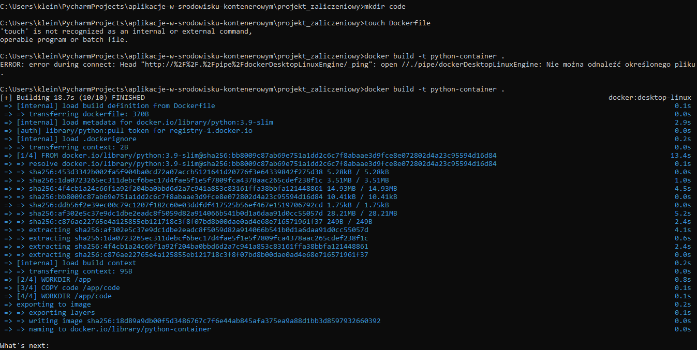

### 2. Skopiuj wybrany plik tekstowy z hosta (swojego komputera) do kontenera Dockerowego
Utworzyłam nowy podfolder w folderze mojego projektu, a w nim plik example.txt ` echo "To jest plik tekstowy do skopiowania do kontenera." > example.txt`, nastepnie
w tym samym podfolderze utworzyłam Dockerfile 
`FROM python:3.9-slim
WORKDIR /app
COPY example.txt /app/
CMD ["cat", "/app/example.txt"]
` po czym zbudowałam obraz `docker build -t text-file-container .` i na koniec uruchomiłam konetener na podstawie zbudowaniego obrazu `docker run --rm text-file-container`

2 sposób  
kopiuje plik example.txt do katalogu /root w kontenerze `docker cp ./example.txt my-container:/root/example.txt`
po skopiowaniu sprawdzam czy plik tam jest, loguje sie wiec do kontenera `docker exec -it my-container /bin/bash`
sprawdzam zawartość katalogu /root `ls /root`
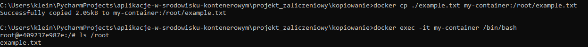


### 3. Skopiuj wybrany plik tekstowy z kontenera Dockerowego do hosta (swojego komputera).
Najpierw zalogowałam sie do kontenera `docker exec -it my-container /bin/bash`,
następnie utworzyłam plik example.txt w katalogu /root `echo "To jest przykładowy plik tekstowy." > /root/example.txt`
#### potem skopiowałam plik z kontenera na hosta `docker cp my-container:/root/example.txt ./example.txt`
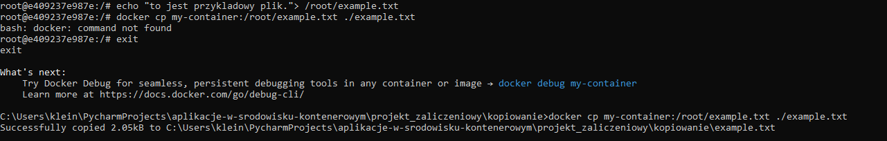

### 4. Pokaż działanie komend ENTRYPOINT i CMD w wybranym projekcie.
Różnica między ENTRYPOINT a CMD:

CMD: Służy do ustawienia domyślnego polecenia lub parametrów, które mogą być nadpisane w momencie uruchamiania kontenera.

ENTRYPOINT: Definiuje, co ma być zawsze wykonywane, a dodatkowe argumenty mogą być przekazywane w czasie uruchamiania.

#### Przygotowanie projektu
Utworzyłam osobny folder entry-point, a w nim Dockerfile 
```
# Użyj oficjalnego obrazu Pythona
FROM python:3.9-slim

# Skopiuj plik Pythonowy do obrazu
COPY script.py /app/script.py

# Ustaw katalog roboczy
WORKDIR /app

# Domyślna komenda przy użyciu CMD
CMD ["python3", "script.py"]

```
następnie wewnatrz utworzonego folderu plik script.py, aby wyświetlał dane wejściowe lub domyślną wiadomość
```
import sys

if len(sys.argv) > 1:
    print(f"Argumenty: {', '.join(sys.argv[1:])}")
else:
    print("Uruchomiono skrypt bez argumentów!")

```
na koniec buduje obraz `docker build -t cmd-demo .`

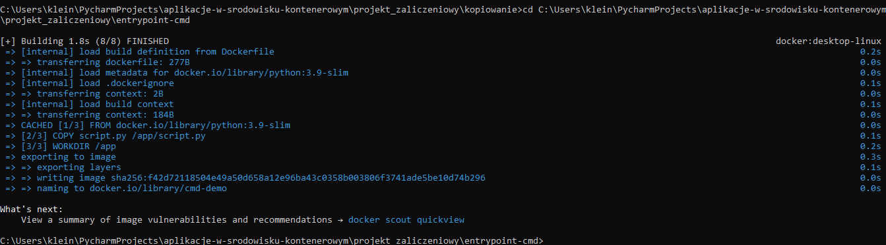

#### Działanie CMD
uruchomiłam kontener `docker run cmd-demo`

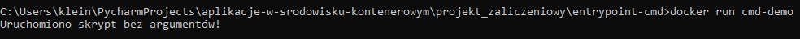

#### Działanie ENTRYPOINT
zmieniamy w dockerfile
````
# Użyj oficjalnego obrazu Pythona
FROM python:3.9-slim

# Skopiuj plik Pythonowy do obrazu
COPY script.py /app/script.py

# Ustaw katalog roboczy
WORKDIR /app

# Domyślna komenda przy użyciu ENTRYPOINT
ENTRYPOINT ["python3", "script.py"]
````
buduje nowy obraz entrypoint-demo `docker build -t entrypoint-demo .`
oraz uruchamiam go `docker run entrypoint-demo`
można również z dodatkowymi atrybutami `docker run entrypoint-demo argument1 argument2`

### 5. Pokaż działanie usługi bazodanowej z wykorzystaniem docker-compose.
Utworzyłam podfolder docker-compose a w nim plik docker-compose.yml, nastepnie uruchomilam usluge baz danych
`docker-compose up`
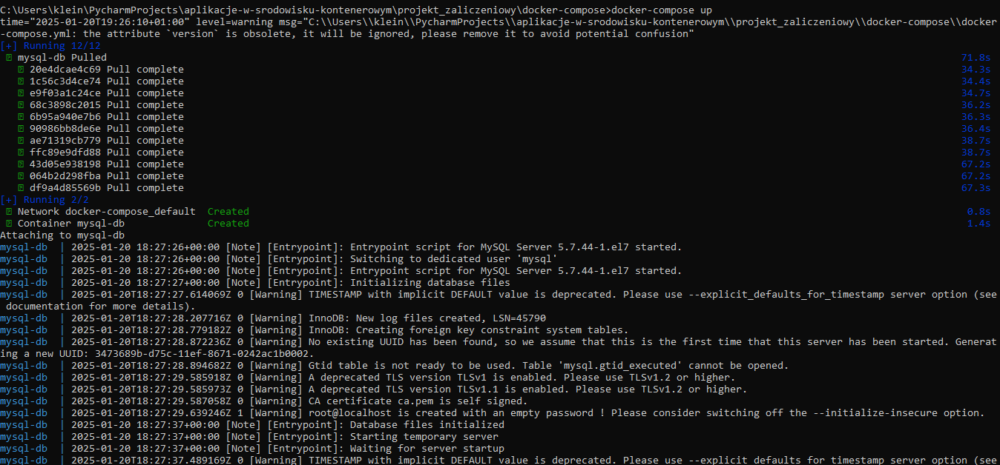
Po uruchomieniu bazy danych sprawdzam działające kontenery `docker ps`
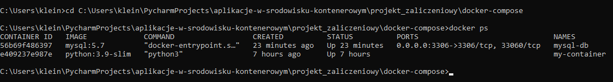
moge połączyć się z bazą danych MySQL w kontenerze
wchodze do kontenera`docker exec -it mysql-db mysql -u root -ppassword` nastepnie wpisuje `SHOW DATABASES`
a po wszystkim `EXIT`
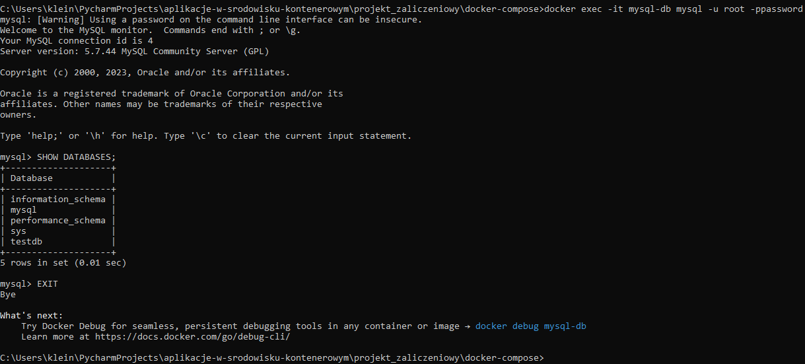
`docker-compose.yml`:
Plik definiuje usługę bazy danych MySQL. Tworzy użytkownika, hasło oraz przykładową bazę danych.

Uruchomienie `docker-compose up`:
Pobiera obraz MySQL, jeśli jeszcze go nie ma.
Uruchamia kontener z MySQL na porcie 3306.

### 6. Pokaż działanie komend ADD i COPY i WORKDIR w wybranym projekcie.
Tworze folder add-copy-workdir, nastepnie dodaje w tym folderze Dockerfile, example.txt, kolejny folder a w nim another_example.txt
w example dodaje `To jest plik dodany przez COPY.`
w pliku another dodaje `To jest plik dodany przez ADD.`
potem buduje obraz `docker build -t add-copy-workdir-demo .`
i uruchamiam kontener `docker run --rm add-copy-workdir-demo`

W wyniku działania polecenia `ls -l` zostanie wyświetlona lista plików w katalogu roboczym /app w kontenerze:
````
total 8
-rwxr-xr-x 1 root root 32 Jan 20 19:04 another_example.txt
-rwxr-xr-x 1 root root 33 Jan 20 19:04 example.txt
````
`WORKDIR /app`:
Ustawia katalog roboczy w kontenerze na /app. Wszystkie kolejne komendy (np. COPY, ADD) operują w tym katalogu.

`COPY example.txt .`:
Kopiuje plik example.txt z hosta do katalogu roboczego /app w kontenerze.

`ADD files/another_example.txt .`:
Kopiuje plik another_example.txt z hosta do katalogu roboczego /app w kontenerze.
ADD dodatkowo może obsłużyć zdalne adresy URL lub rozpakować archiwa .tar podczas kopiowania (ale tego tutaj nie używamy).

*dodatkowo* :
sprawdzam zawartość katalogu roboczego w środku kontenera:
`docker run -it --rm add-copy-workdir-demo /bin/bash`
i wpisuje `ls -l`, `cat example.txt` i `cat another_example.txt`
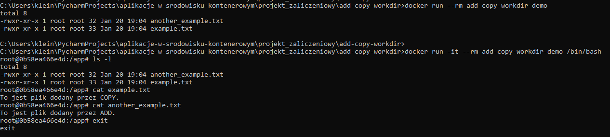

### 8. Omów na podstawie swojej aplikacji komendy docker inspect i docker logs.
Utworzylam folder roboczy inspect-logs, a w nim utworzylam plik app.py oraz dockerfile
następnie buduje obraz w folderze roboczym `docker build -t inspect-logs-demo .` potem uruchamiam kontener `docker run -d --name demo-container inspect-logs-demo`

Komenda docker `INSPECT`  służy do wyświetlania szczegółowych informacji o kontenerze lub obrazie.
`docker inspect demo-container` Wynik to obszerne dane w formacie JSON, które zawierają informacje, takie jak:
+ ID kontenera
+ Obraz użyty do uruchomienia kontenera
+ IP kontenera
+ Ścieżka katalogu roboczego
+ Uruchomiona komenda

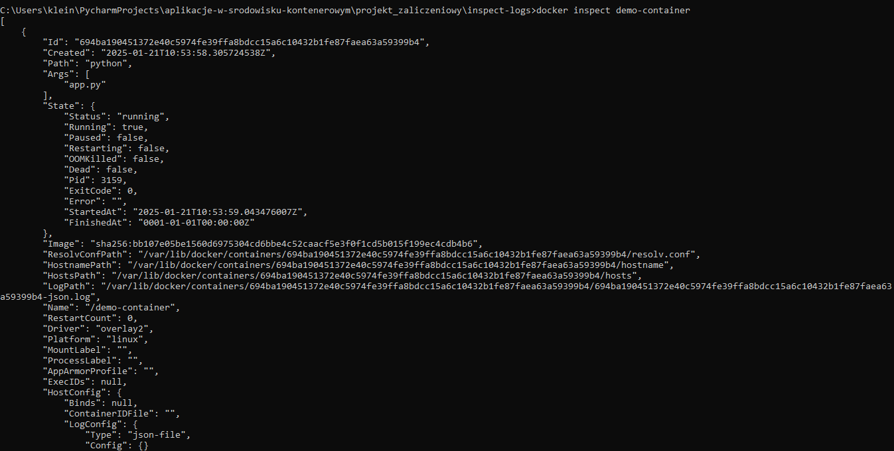
Komenda `docker logs` pozwala podejrzeć wyjście logów kontenera. W tym przypadku zobaczysz tekst, który aplikacja wypisuje co 5 sekund.

Aby zobaczyć logi kontenera wpisuje `docker logs demo-container`

(powinno działać ale nie działa dopiero jak wpisze `docker run -it --rm inspect-logs-demo`)- czyl uruchamiam kontener w trybie interaktywnym, aby zobaczyć, co się dzieje w środku
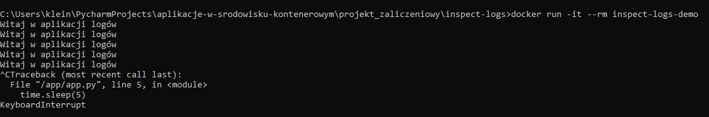

docker logs:

* Pokazuje wyjście z aplikacji działającej w kontenerze.
* Przykład: logi naszej aplikacji wypisującej "Witaj w aplikacji logów!".

docker inspect:
* Wyświetla szczegółowe dane o kontenerze (lub obrazie).
* Przykład: informacje o katalogu roboczym, adresie IP kontenera itp.

### 9. Czym są sieci w Dockerze? Zaprezentuj przykład na bazie swojego projektu.
Sieci w Dockerze pozwalają kontenerom na komunikację ze sobą oraz z hostem. Każdy kontener działa w swojej wirtualnej sieci, co umożliwia kontrolowanie ich interakcji.

Rodzaje sieci w Dockerze

* Bridge (domyślna sieć): Kontenery na tej samej sieci bridge mogą komunikować się ze sobą.

* Host: Używa sieci hosta. Kontener działa w tej samej sieci, co host, bez izolacji.

* None: Kontener jest odizolowany i nie ma połączenia z żadną siecią.

* Custom network (tworzona przez użytkownika): Umożliwia lepszą kontrolę nad komunikacją między kontenerami.

Próbowałam stworzyc sieć `my-network` za pomoca `docker network create my_network` 
nastepnie stworzylam plik `docker-compose.yml` aby zdefiniowac dwa serwisy: aplikacje i baze danych, ktore beda działac na tej samej sieci
utworzylam plik aplikacji `app.py` ktora laczy sie z baza danych na poczatek w oddzielnym folderze app ale potem wszystko wrzucilam do jednego,
po czym zainstalowalam wymagane biblioteki w kontenerze aplikacji `docker exec -it app-container pip install psycopg2`, 
uruchomilam kontenery `docker-compose up -d`, W kontenerze aplikacji wykonalam polecenie, by sprawdzić, czy widzi bazę danych `docker exec -it app-container ping db-container`, 
na koniec sprawdzilam utworzoną sieć i podłączone kontenery `docker network inspect my_network`

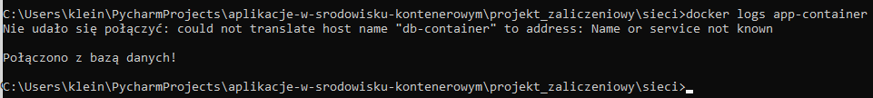

### 10. Jaka jest różnica między obrazem i kontenerem? Pokaż przykład budowania obrazu (Dockerfile) i uruchamiania na jego podstawie kontenera.
#### Obraz (Image):

Obraz to statyczny, niezmienny plik, który zawiera wszystkie zależności, bibliotek, aplikacji, plików i konfiguracji, które są potrzebne do uruchomienia aplikacji. Obraz może być traktowany jako "szablon" lub "swoistego rodzaju snapshot" dla kontenera. Obraz jest używany do tworzenia kontenerów.

#### Kontener (Container): 
Kontener to uruchomiona instancja obrazu. Jest to środowisko, w którym aplikacja działa, będące odizolowane od innych procesów i systemu operacyjnego. Kontener jest dynamiczny i może być uruchamiany, zatrzymywany lub usuwany. Zawiera wszystkie zasoby (takie jak procesy, pamięć, zmienne środowiskowe), które zostały zdefiniowane w obrazie.

#### Jak zbudowac obraz za pomoca Dockerfile, prosty przykład budowania obrazu i uruchamiania kontenera

Dockerfile to plik tekstowy, który zawiera instrukcje, jak zbudować obraz Docker. Poniżej pokażę przykład, jak stworzyć taki plik i jak na jego podstawie zbudować obraz.

Tworze folder roboczy node-app, a w nim plik Dockerfile (plik do budowania obrazu) oraz app.js (prosta aplikacja Node.js)
Zawartość Dockerfile 
```
# Używamy gotowego obrazu Node.js
FROM node:14

# Kopiujemy pliki aplikacji do kontenera
COPY app.js /app.js

# Określamy polecenie do uruchomienia aplikacji
CMD ["node", "/app.js"]

```
Ten Dockerfile mówi Dockerowi, aby:
+ Wziął gotowy obraz Node.js w wersji 14.
+ Skopiował plik app.js do kontenera.
+ Uruchomił aplikację za pomocą komendy node app.js.

Nastepnie uzupelniam plik app.js `console.log("Hello from Docker!");`

Buduje teraz w terminalu obraz `docker build -t my-node-app .` po zbudowaniu uruchamiam kontener `docker run my-node-app`
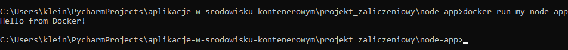
To oznacza ze aplikacja odpalila sie w kontenerze.

#### Podsumowanie
* Obraz to jakby szablon z aplikacją.
* Kontener to uruchomiona instancja tego obrazu.
* Wystarczy napisać prosty Dockerfile i użyć dwóch komend (docker build i docker run), aby stworzyć obraz i uruchomić kontener.

### 11. Pokaż jak "wejść" do wybranego kontenera. Utwórz w nim plik tekstowy z dowolnymi danymi. Co zrobić, żeby po zamknięciu kontenera dane z pliku były dostępne po ponownym uruchomieniu kontenera? Zademonstruj dowolny sposób.
#### Jak "wejść" do kontenera?

Sprawdzam, jakie kontenery są uruchomione `docker ps`

W wynikach tej komendy znajdziesz identyfikatory (ID) uruchomionych kontenerów.

Aby wejść do kontenera, używam komendy`docker exec -it <container_id> /bin/bash` oczywiscie zmieniajac id na id konetenera do ktorego chcemy wejsc

W srodku tworzymy plik tekstowy `echo "To jest testowy plik w kontenerze!" > /test.txt`, sprawdzamy czy plik powstal `cat /test.txt`
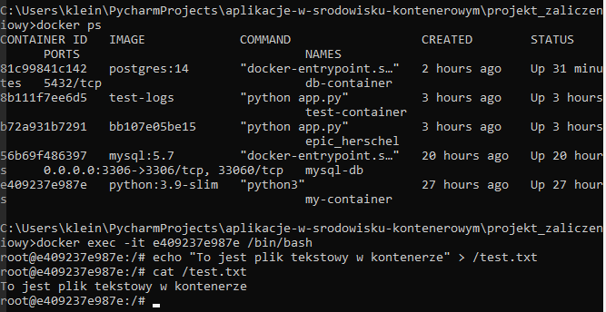

#### Jak zachować dane po zamknięciu kontenera?

Zatrzymaj i usuń kontener (jeśli jest już uruchomiony) 
`docker stop <container_id>` `docker rm <container_id>`

Uruchamiam teraz kontener z wolumenem aby dane byly przechowywane na zewnatrz `docker run -v C:/Users/klein/PycharmProjects/aplikacje-w-srodowisku-kontenerowym/projekt_zaliczeniowy:/data -it ubuntu /bin/bash`

Nastepnie tworze plik w mapowanym katalogu `echo "Testowe dane z wolumenu" > /data/test.txt`

po czym zatrzymuje ten kontener `docker stop <container_id>` uruchamiam ponownie tamten `docker run -v C:/Users/klein/PycharmProjects/aplikacje-w-srodowisku-kontenerowym/projekt_zaliczeniowy:/data -it ubuntu /bin/bash`

sprawdzam pliki w tym kontenerze `cat /data/test.txt` i wszystko dziala.
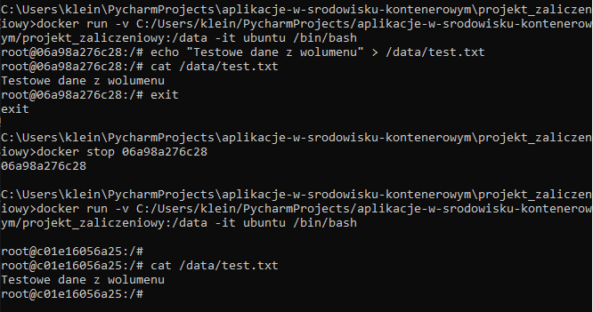

### 12. Zbuduj wybrany przez siebie obraz, nadaj mu 'tag' i opublikuj na DockerHubie. Następnie usuń lokalnie ww. obraz i pobierz go z DockerHuba.
Przygotowałam plik Dockerfile w folderze roboczym
````
# Używamy oficjalnego obrazu Ubuntu jako bazowego
FROM ubuntu:latest

# Instalujemy curl
RUN apt-get update && apt-get install -y curl

# Ustawiamy domyślną komendę po uruchomieniu kontenera
CMD ["bash"]
````
nastepnie buduje obraz `docker build -t my-ubuntu-curl .`, dodałam mu opcjonalnie tag ktory zawiera nazwe uzytkownika i wersje obrazu `docker tag my-ubuntu-curl juliakleinszmidt/my-ubuntu-curl:v1`

zalogowalam sie na dockerhub `docker login`

nastepnie wypchnelam obraz na swoje konto `docker push myusername/my-ubuntu-curl:v1`
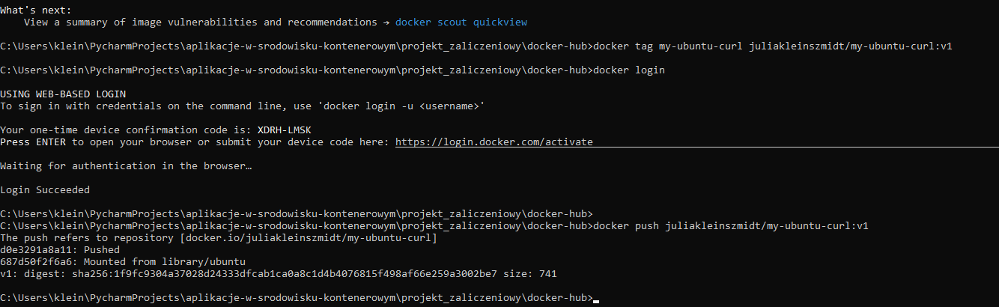

#### Usuwam obraz lokalnie
aby usunac lokalnie uzywam komendy `docker rmi juliakleinszmidt/my-ubuntu-curl:v1`

Pobieram obraz z dockerHub uzywajac komendy `docker pull juliakleinszmidt/my-ubuntu-curl:v1`
Docker pobierze obraz z DockerHub i zapisze go lokalnie na komputerze

Na koniec sprawdzam czy obraz jest dostepny lokalnie `docker images`
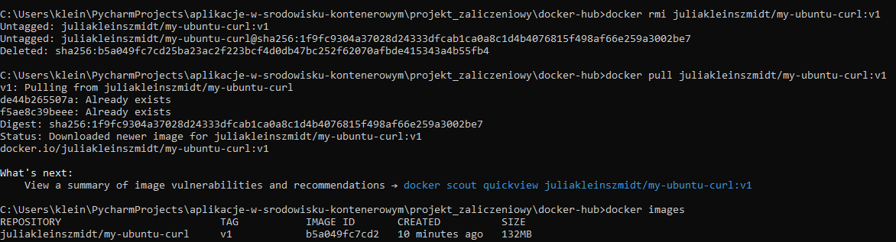
